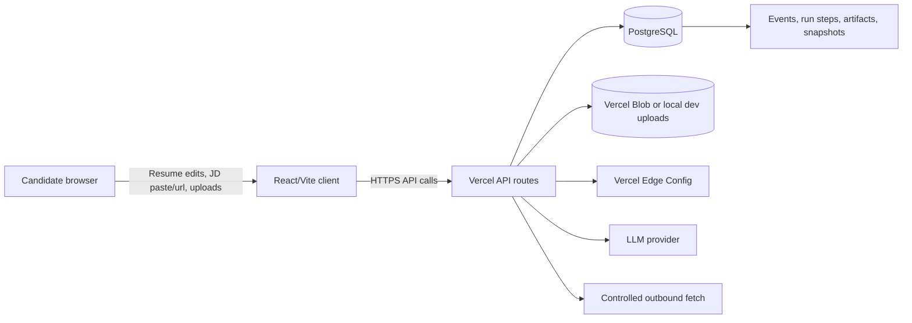
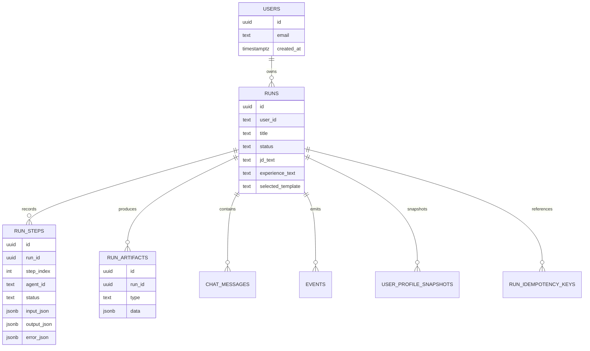
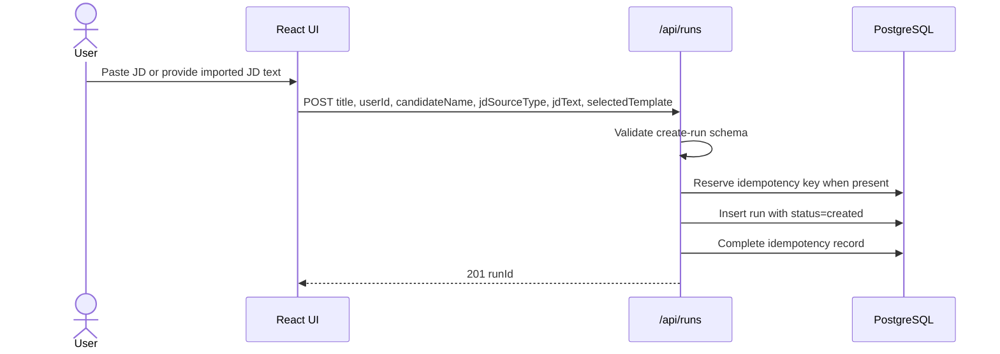
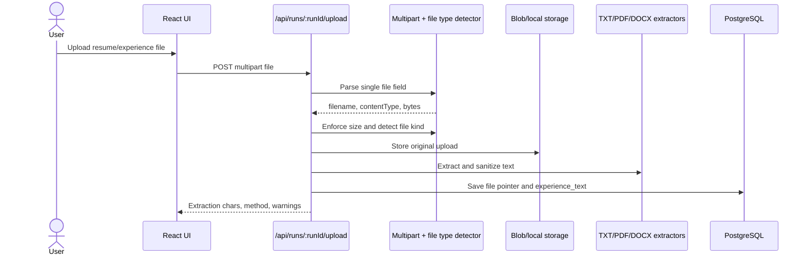
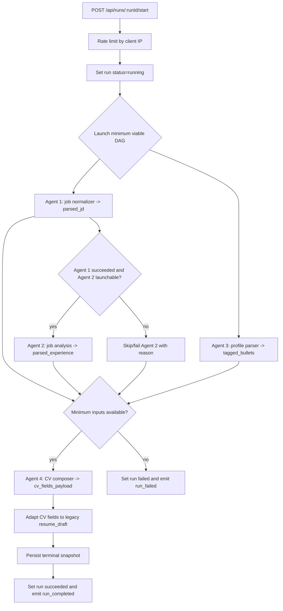
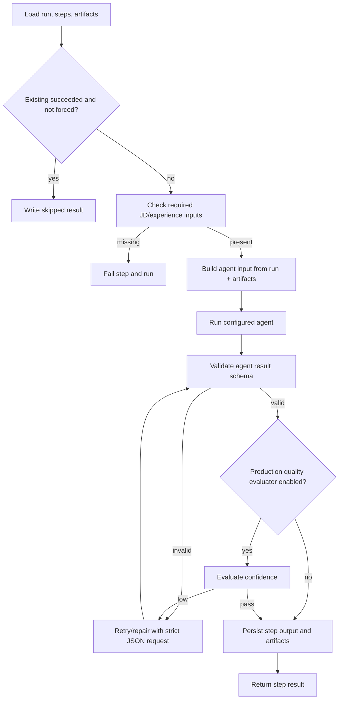
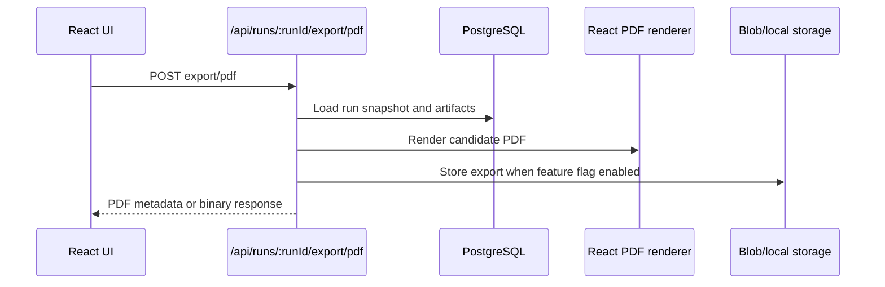
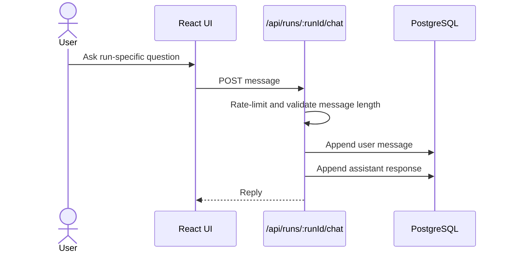
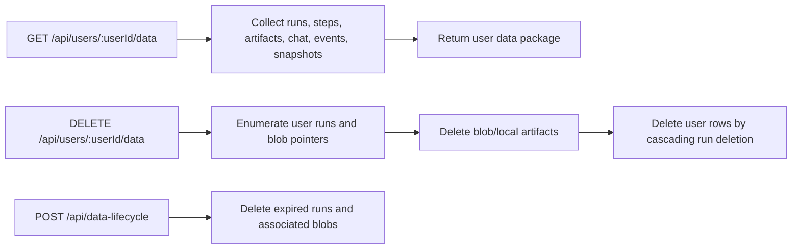

# JobHunt Copilot Executive Design and Architecture Plan

## 1. Executive summary

JobHunt Copilot is a web application that helps a candidate transform a job description and personal experience material into tailored resume, cover-letter, and assistant artifacts. The product uses a React/Vite client, Vercel serverless API routes, a PostgreSQL-backed run ledger, object/blob storage for uploaded and exported files, and a server-side multi-agent orchestration layer.

The strategic design objective is to provide a repeatable, auditable, and privacy-aware document generation workflow. Each user action creates or updates a `run`, each agent execution records structured input, output, and events, and generated artifacts are persisted separately from step telemetry so the product can support retries, resumability, governance reviews, user data export, and deletion.

## 2. Business goals and non-goals

### Goals

- **Speed up job applications:** Convert raw job descriptions and candidate history into high-quality application assets.
- **Improve fit and consistency:** Normalize job requirements, parse candidate experience, tag bullets, and compose CV fields using a defined agent sequence.
- **Support auditability:** Store run status, step states, artifacts, events, idempotency keys, and terminal snapshots so outcomes can be reviewed.
- **Reduce operational risk:** Validate inputs, detect file types using content signatures, redact sensitive logs, rate-limit expensive routes, and gate model output with schemas.
- **Enable future personalization:** Preserve structured, versioned snapshots that can power future user profiles and learning loops without losing lineage.

### Non-goals

- The system is not intended to make hiring decisions or rank candidates for employers.
- The system should not store raw provider API keys in the browser.
- The system should not scrape arbitrary web pages without URL validation and network safety controls.
- The system should not bypass a user's ability to review, edit, export, or delete their data.

## 3. Stakeholders and operating model

| Stakeholder | Primary needs | Architecture response |
| --- | --- | --- |
| Candidate/user | Fast asset generation, editable output, data control | Guided UI, resumable runs, export endpoints, user data export and deletion APIs |
| Product owner | Reliable generation funnel and feature flexibility | Feature flags through Edge Config/environment fallback and isolated agent definitions |
| Engineering | Testability, deterministic state, low vendor lock-in | Shared Zod schemas, repository layer, serverless API boundaries, storage abstraction |
| Security/privacy reviewer | Least data exposure and deletion ability | Sensitive log redaction, file validation, retention cleanup, per-user export/erase flows |
| Operations | Observability and incident review | Event table, step table, run status, retry metadata, terminal parquet snapshots |

## 4. Current system context



### Main deployable components

- **Client application:** React application responsible for resume editing, section ordering/visibility, preview/export interactions, model settings UI, and calling server APIs.
- **API routes:** Vercel-compatible handlers for run creation, run inspection, orchestration start, step execution, chat, upload, artifact retrieval, export, job-description import, company insights, health, and data lifecycle operations.
- **Orchestrator:** Server-side workflow that executes the agent DAG, validates prerequisites, retries transient work, persists step envelopes, updates artifacts, and writes terminal snapshots.
- **Agent layer:** Ordered agent definitions for job normalization, experience/job analysis, profile parsing, CV field composition, cover-letter drafting, and assistant QA.
- **Storage layer:** PostgreSQL tables for users, runs, run steps, artifacts, chat messages, events, idempotency keys, and profile snapshots; blob/local storage for uploaded experience files and generated exports.
- **Configuration layer:** Edge Config plus environment fallback for model routing and feature flags.

## 5. Domain model



### Core entities

- **Run:** The top-level application workflow instance. It captures the candidate context, job-description source, normalized status, selected template, upload pointers, and current progress.
- **Run step:** A durable record of one agent invocation, including input, output, status, retry/duration metadata, schema versions, errors, output pointers, and artifact snapshots.
- **Run artifact:** A typed generated object such as `parsed_jd`, `parsed_experience`, `tagged_bullets`, `cv_fields_payload`, `resume_draft`, `cover_letter_draft`, or `assistant_qa`.
- **Event:** Append-only operational breadcrumb such as run started, step started, run failed, and run completed.
- **Idempotency key:** A deduplication record for routes that should safely handle retries from browsers or edge networks.
- **User profile snapshot:** A terminal parquet snapshot of selected profile and output data for later governance, analytics, or portability workflows.

## 6. High-level request flows

### 6.1 New run and job-description ingestion



**Logic:**

1. The client submits structured run creation data.
2. The API validates the request with the shared schema.
3. If an idempotency key is supplied, the API rejects mismatched reuse, blocks in-progress duplicates, or replays the original response.
4. The repository creates a run with normalized source metadata and initial status.
5. The `runId` becomes the correlation identifier for upload, orchestration, events, chat, artifact, and export routes.

### 6.2 Experience upload and text extraction



**Logic:**

1. The route accepts one multipart file and enforces an upload size ceiling.
2. Detection uses content signatures, MIME type, extension, and text-likeliness checks.
3. Unsupported or suspicious files are rejected before persistence of extracted text.
4. The original file is stored in Vercel Blob when configured, or local fallback storage in development.
5. Text is extracted through format-specific handlers and sanitized before writing `runs.experience_text`.
6. The response includes extraction metadata so the UI can warn the user if quality is degraded.

### 6.3 Orchestrated generation flow



**Logic:**

- Agent 1 and Agent 3 start in parallel to reduce latency.
- Agent 2 waits for a successful Agent 1 handoff and verified experience text.
- Agent 4 runs only when minimum inputs are present: a successful or existing `parsed_jd`, `parsed_experience`, and `tagged_bullets` path.
- Each step writes a running row before execution and a terminal row after success, skip, or failure.
- Agent results are schema-validated, artifacts are upserted by type, and downstream consumers read the artifact ledger instead of relying on transient memory.
- Terminal state triggers a parquet snapshot write for governance and analytics use cases.

### 6.4 Step execution and repair loop



**Logic:**

- Required input checks fail fast: Agent 1 needs job-description text; steps 2 and above need experience text.
- Retry behavior is controlled by environment defaults for maximum attempts, elapsed time, and base delay.
- Optional production quality evaluation can run on critical steps and require confidence above a configured threshold.
- Schema failures are flattened into structured errors so the UI and operators can distinguish invalid output from system failures.

### 6.5 Artifact export and retrieval



**Logic:**

- The export route reads the latest run snapshot and artifact data.
- Candidate names are sanitized before constructing export file names.
- Export persistence is controlled by the `storeExportsInBlob` feature flag.
- Artifact reads use encoded artifact identifiers and return `Cache-Control: no-store`.

### 6.6 Chat and assistant context



**Logic:**

- Chat messages are scoped to a run.
- User messages are validated for length before persistence.
- The current implementation stores a deterministic acknowledgement and creates an extension point for assistant QA context.

### 6.7 Data export, deletion, and retention



**Logic:**

- Data subject access uses a user-scoped export API.
- Erasure deletes database records and associated file objects where pointers are available.
- Retention cleanup is isolated behind a server route that can be called by an authorized scheduler in production.

## 7. Agent architecture plan

| Step | Agent | Role | Primary input | Primary artifact | Key governance control |
| --- | --- | --- | --- | --- | --- |
| 1 | Job normalizer | Planner | Job description text and source metadata | `parsed_jd` | Structured schema validates job identity and handoff fields |
| 2 | Job analysis | Extractor | Agent 1 output plus experience text | `parsed_experience` | Launch gate requires Agent 1 handoff and non-empty experience text |
| 3 | Profile parser | Extractor | Candidate experience text and run metadata | `tagged_bullets` | Runs in parallel but cannot unblock final composition alone |
| 4 | CV composer | Writer | JD text, experience text, artifacts, CV field registry | `cv_fields_payload`, `resume_draft` | Registry defaults and output schema constrain generated field payload |
| 5 | Cover letter | Writer | Run and artifact context | `cover_letter_draft` | Isolated step with schema envelope for future gating |
| 6 | Assistant QA | Verifier | Run, artifacts, and chat context | `assistant_qa` | Verification role supports future review workflows |

### Agent design principles

- **Typed boundaries:** Each agent returns an `AgentResult` shape with `ok`, `artifactUpdates`, `nextHints`, and `errors`.
- **Artifact-first handoff:** Downstream steps use persisted artifacts rather than hidden process state.
- **Repair before failure:** Invalid or low-confidence outputs can be retried and repaired under stricter JSON constraints.
- **Registry-driven CV fields:** Agent 4 composes a complete CV field payload from the field registry so downstream templates receive stable keys.
- **Extensible ordered list:** Steps 5 and 6 are defined even when the minimum DAG currently completes at Agent 4, enabling later cover-letter and QA expansion without changing core storage.

## 8. Runtime and deployment architecture

```mermaid
flowchart TB
  subgraph Browser
    UI[React UI]
  end
  subgraph Vercel
    API[Serverless API routes]
    Health[/api/health]
    Edge[Edge Config]
  end
  subgraph Data
    PG[(PostgreSQL)]
    Blob[(Vercel Blob)]
    Local[(Local upload fallback for dev)]
  end
  subgraph External
    OpenAI[LLM provider]
    Sites[Job posting URLs]
  end

  UI --> API
  API --> PG
  API --> Blob
  API -. dev only .-> Local
  API --> Edge
  API --> OpenAI
  API --> Sites
  Health --> PG
  Health --> Edge
```

### Environment configuration

- `OPENAI_API_KEY`: required for provider-backed model execution.
- `OPENAI_MODEL`: default model fallback for all agent roles.
- `DATABASE_URL`: required for PostgreSQL persistence.
- `BLOB_READ_WRITE_TOKEN`: enables Blob storage; development can fall back to local file storage.
- `EDGE_CONFIG`: enables dynamic default model and feature flag lookup.
- Feature flags: company insights, BYOK, export storage, and production quality evaluator.

### Operational health

- Health checks should verify API liveness, provider configuration, selected model, database availability, storage mode, and Edge Config status.
- The event ledger should be monitored for repeated `run_failed` and step-level errors.
- Duration and retry metadata should feed latency SLO dashboards once production telemetry is connected.

## 9. Resilience, scalability, and failure handling

### Resilience controls

- **Idempotent run creation and start:** Browser retries do not create duplicate runs or duplicate starts when an idempotency key is supplied.
- **Rate limiting:** Start and chat routes apply a basic IP-scoped rate limiter to reduce abuse and runaway cost.
- **Fail-fast prerequisites:** Missing job-description or experience text fails before model execution.
- **Retry budget:** Agent execution uses bounded attempts and elapsed time to avoid indefinite loops.
- **Fallback artifact detection:** The DAG can proceed when prior successful artifacts already exist, supporting resume/retry scenarios.
- **Terminal snapshots:** Completed or failed terminal states can persist a compact profile/output snapshot for later review.

### Scaling plan

| Concern | Current design | Next scaling step |
| --- | --- | --- |
| Long-running orchestration | Serverless request starts synchronous DAG | Move DAG execution to a queue/worker and return `202 Accepted` |
| High upload volume | Blob/local file abstraction | Enforce per-user quotas and malware scanning before long-term retention |
| Concurrent run starts | Idempotency keys and run status | Add advisory locks or queue de-duplication by run ID |
| Artifact growth | JSONB artifacts and blob exports | Introduce artifact versioning, archival storage, and TTL policies |
| Model cost | Feature flags and role-model routing | Add per-user budgets, model fallback tiers, and token telemetry |

## 10. Observability and audit plan

| Signal | Source | Purpose |
| --- | --- | --- |
| Run status | `runs.status` | Product funnel, support triage, user-visible progress |
| Current step | `runs.current_step` | UX progress indicator and failure location |
| Step status/duration/retry | `run_steps` | Agent health, latency, and retry analysis |
| Structured errors | `run_steps.error_json`, `runs.error_summary` | Debugging without exposing sensitive content |
| Events | `events` | Timeline reconstruction and operational audit |
| Artifact types | `run_artifacts.type` | Completeness checks and downstream export readiness |
| Data lifecycle results | lifecycle route result | Governance and retention audit evidence |

## 11. Architecture risks and mitigation roadmap

| Risk | Impact | Mitigation |
| --- | --- | --- |
| PII in prompts and artifacts | Privacy and compliance exposure | Apply data minimization, prompt redaction where possible, strict retention, and data processing terms with providers |
| Synchronous orchestration timeout | Failed generation under high latency | Move orchestration to async queue and poll status/events |
| Weak route authentication in local-first mode | Unauthorized data access in production if deployed as-is | Require authenticated sessions and user/run authorization checks before production release |
| Uploaded malicious files | Security exposure | Add antivirus scanning, stricter content validation, and quarantine workflow |
| Browser BYOK misuse | Secret leakage | Keep BYOK disabled until token exchange or encrypted server-side key vault is implemented |
| Artifact schema drift | Broken exports or templates | Version artifact schemas and maintain migration/adaptation tests |
| Log leakage | Sensitive data exposure | Keep redaction centralized, prohibit raw request logging, and test redaction patterns |

## 12. Target-state roadmap

1. **Production authorization layer:** Add authenticated users, route guards, run ownership checks, and admin-only lifecycle access.
2. **Async orchestration:** Move generation into queue-backed workers with webhooks or polling.
3. **Full model integration:** Replace deterministic placeholder agent bodies with provider calls that preserve schema validation, repair, and quality gates.
4. **Policy engine:** Centralize retention, export, deletion, model-use, and feature-flag decisions in a governance module.
5. **Security hardening:** Add malware scanning, secret vaulting, dependency scanning, and artifact encryption strategy.
6. **Metrics and alerting:** Emit structured telemetry for run completion rate, cost, latency, extraction warnings, quality-gate failures, and data lifecycle actions.
7. **Compliance evidence pack:** Maintain DPIA/PIA, data map, subprocessors list, incident playbooks, access review records, and retention audit reports.
