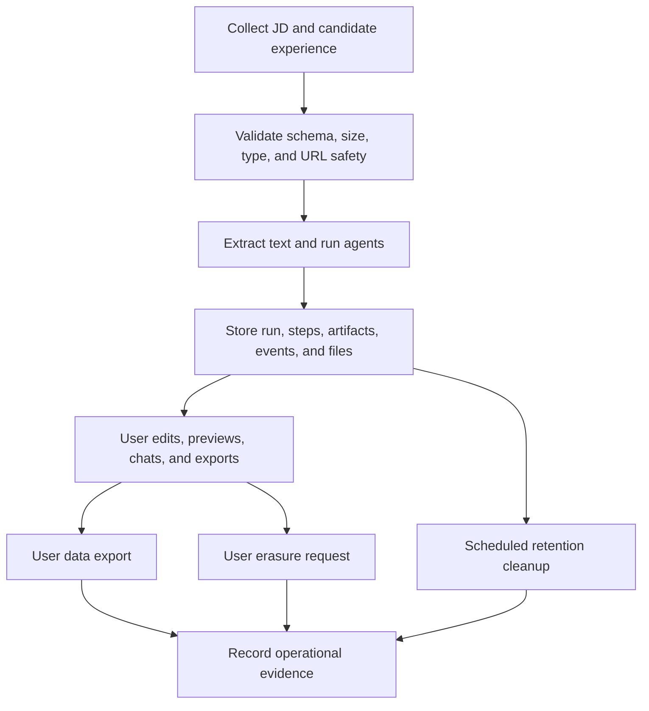
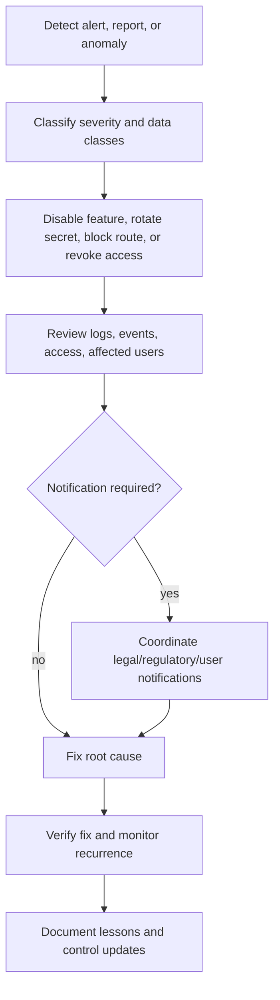

# JobHunt Copilot Privacy, Safety, Compliance, and Governance Plan

## 1. Executive summary

JobHunt Copilot processes sensitive career data: job descriptions, resumes, employment history, education, skills, chat messages, generated resume content, cover-letter drafts, and operational metadata. This document defines the privacy rules, safety measures, compliance posture, and governance model required to operate the system responsibly.

The policy intent is simple: collect only what is needed to generate application assets, protect it while it is processed and stored, give users meaningful access and deletion rights, prevent secret leakage, and keep enough audit evidence to prove the system is functioning as designed.

## 2. Data classification

| Data class | Examples | Sensitivity | Handling rule |
| --- | --- | --- | --- |
| Account identifiers | User ID, email | Personal data | Store only for account, ownership, and data rights workflows |
| Candidate profile | Name, phone, location, LinkedIn, portfolio | Personal data / PII | Minimize, encrypt in transit, redact from logs, delete on request |
| Career history | Uploaded resume, extracted experience text, education, skills, achievements | Sensitive personal data by context | Treat as confidential user content; restrict access and retention |
| Job-description data | Pasted JD, imported JD URL/text, company and role | User-provided content | Hash where possible for integrity/deduplication; avoid unnecessary replication |
| Generated artifacts | Parsed JD, parsed experience, tagged bullets, CV fields, resume draft, cover letter, assistant QA | Derived personal data | Apply same controls as source candidate data |
| Chat messages | Run-scoped user/assistant messages | User content | Validate length, store by run, include in export/deletion |
| Operational telemetry | Events, step status, retry counts, durations, errors | Metadata, may contain sensitive references | Redact payloads and keep structured errors concise |
| Secrets | Provider API keys, blob token, database URL, Edge Config token | Highly sensitive secret | Server-side environment only; never expose through `VITE_*` or browser storage |
| File objects | Uploaded experience files, exported PDFs, snapshots | Confidential user content | Store through controlled blob/local abstraction; delete with user/run lifecycle |

## 3. Privacy principles

1. **Purpose limitation:** Use candidate data only to generate, edit, export, support, secure, and govern job-application assets.
2. **Data minimization:** Do not request demographic, protected-class, government ID, financial, health, or unrelated background information.
3. **User control:** Provide export and deletion mechanisms for user-scoped records and associated file objects.
4. **Transparency:** Tell users that uploaded resumes and generated artifacts may be processed by server-side agents and configured model providers.
5. **Storage limitation:** Retain raw uploads, extracted text, artifacts, and snapshots only for the configured retention period or until deletion is requested.
6. **Security by default:** Keep secrets server-side, redact logs, validate files, rate-limit high-cost routes, and avoid client-side raw credential storage.
7. **Accountability:** Maintain auditable events, lifecycle results, access reviews, and change history for privacy-affecting behavior.

## 4. Data lifecycle rules

### Collection

- Collect job-description text, candidate-provided experience files, and optional profile fields only when needed for a run.
- Validate JSON request bodies with shared schemas before persistence.
- Limit chat messages to the configured maximum length.
- Limit uploads to the configured byte ceiling and supported formats.

### Processing

- Extract TXT, PDF, and DOCX content only after file-kind detection.
- Sanitize extracted text and reject output that appears corrupt or too low quality for generation.
- Do not log raw uploaded file bytes, raw resume text, raw job-description text, provider secrets, authorization headers, or blob tokens.
- Apply model-output schemas and repair loops before persisting agent artifacts.

### Storage

- Store run state, steps, artifacts, chat messages, events, idempotency keys, and snapshots in PostgreSQL.
- Store uploaded files and exports through the blob abstraction, with local fallback limited to development.
- Keep source text and derived artifacts in the same confidentiality class.
- Use hashes for integrity and deduplication where already supported, while recognizing hashes are not a substitute for deletion.

### Use and sharing

- Use data only for the user-visible run, export, assistant, support, and governance workflows.
- Share content with model providers only under approved provider configuration and data processing terms.
- Do not sell candidate data or use it for unrelated advertising profiles.
- Do not use generated artifacts to make employment eligibility or hiring decisions.

### Retention and deletion

- Provide user-scoped export and delete endpoints.
- Delete associated blob/local objects when deleting user data.
- Run scheduled retention cleanup for expired runs and files.
- Preserve only legally required security/audit metadata if deletion conflicts with abuse, fraud, or legal hold obligations.

## 5. Safety measures

### Input safety controls

| Control | Required behavior | Status in architecture |
| --- | --- | --- |
| Request schema validation | Reject malformed create-run, step, chat, import, and insights payloads | Implemented with shared Zod schemas |
| Upload size limit | Reject files above maximum configured bytes | Implemented in upload route |
| File type validation | Use magic bytes, MIME type, extension, and text-likeliness checks | Implemented for TXT/PDF/DOCX |
| Multipart parsing | Parse binary multipart payloads without converting full file bodies to text | Implemented through Buffer-based parser |
| URL safety | Restrict outbound fetch behavior for imported URLs | Implemented through safe fetch module; production should review allow/block rules |
| Rate limiting | Throttle expensive start and chat routes | Implemented with basic IP-scoped limiter |

### Model and generation safety controls

- Use server-side provider credentials only.
- Route model selection through role-based defaults from Edge Config or environment fallback.
- Constrain agent outputs with schemas and structured `AgentResult` envelopes.
- Repair invalid outputs under stricter JSON-only expectations before accepting failure.
- Run optional production quality evaluation for critical steps when enabled.
- Require user review before treating generated resumes or cover letters as final.
- Add visible warnings that AI output may be incomplete, inaccurate, or overly generic.

### Output safety controls

- Sanitize candidate names before using them in export file names.
- Set artifact download responses to `Cache-Control: no-store`.
- Keep generated artifacts scoped to the run and user.
- Avoid generating discriminatory, deceptive, or unverifiable claims; encourage users to verify claims against their actual experience.
- Maintain provenance by preserving source run IDs, step records, artifacts, and events.

### Operational safety controls

- Redact sensitive fields in server error logs.
- Store structured errors instead of raw prompt, file, or artifact payloads.
- Keep environment secrets outside the client bundle.
- Use feature flags to disable risky capabilities such as BYOK or company insights.
- Add dependency, secret, and infrastructure scanning before production launch.

## 6. Compliance posture

This plan is not legal advice, but it maps the product to common privacy and security obligations that should be validated with counsel before production launch.

### GDPR and UK GDPR readiness

| Principle/right | Product obligation | Required evidence |
| --- | --- | --- |
| Lawfulness, fairness, transparency | Publish clear privacy notice and consent/contract basis for processing | Privacy notice, consent/terms records |
| Purpose limitation | Use data only for job-application assistance and support | Data map and product requirements |
| Data minimization | Avoid unrelated sensitive fields | Form reviews and schema review records |
| Accuracy | Let users review and edit generated content | UI review flow and output disclaimers |
| Storage limitation | Retain data only as long as needed | Retention schedule and cleanup logs |
| Integrity/confidentiality | Apply access, logging, file, and secret controls | Security design, access reviews, test records |
| Access and portability | Export user-scoped data | Export endpoint and response schema |
| Erasure | Delete user data and related file objects | Delete endpoint and deletion audit logs |
| Automated decision-making | Avoid consequential hiring decisions | Product scope and user-facing disclosures |

### CCPA/CPRA readiness

- Provide notice at collection for categories of personal information processed.
- Provide access and deletion workflows.
- Do not sell or share personal information for cross-context behavioral advertising.
- Honor opt-out signals if advertising or tracking is introduced later.
- Maintain service-provider terms with model, hosting, analytics, database, and storage vendors.

### SOC 2 alignment

| Trust services area | Expected controls |
| --- | --- |
| Security | Authentication, authorization, secret management, least privilege, dependency scanning, incident response |
| Availability | Health checks, monitoring, retry limits, queue-backed orchestration roadmap, backup/restore testing |
| Confidentiality | Encryption in transit, restricted database/blob access, redacted logs, access reviews |
| Processing integrity | Schema validation, idempotency, event ledger, step state machine, output quality gates |
| Privacy | Data inventory, retention schedule, export/delete workflows, subprocessors, privacy impact assessment |

### AI governance alignment

- Maintain a model inventory with model names, roles, data sent, provider, retention terms, and fallback behavior.
- Document prompt templates and schema versions for each agent.
- Track quality-gate failures, repairs, and user edits as improvement signals.
- Require human review for final documents.
- Prevent use cases that rank, screen, or reject candidates automatically.

## 7. Governance model

### Roles and responsibilities

| Role | Responsibilities |
| --- | --- |
| Product owner | Defines user-visible data use, retention expectations, and disclosure language |
| Engineering owner | Maintains schemas, storage boundaries, route controls, tests, and deployment safeguards |
| Security owner | Reviews secrets, access controls, vulnerability management, logging, and incident response |
| Privacy owner | Maintains data map, DPIA/PIA, data rights workflows, subprocessors, and retention schedule |
| Support operator | Handles user requests using approved export/delete procedures without raw database access where possible |
| Incident commander | Coordinates privacy/security incidents and post-incident remediation |

### Governance forums

- **Monthly privacy and security review:** Review new data fields, subprocessors, model changes, incidents, and retention results.
- **Quarterly access review:** Confirm production database, blob, logs, and provider-console access remains least privilege.
- **Release review:** Require sign-off for changes to upload handling, prompt routing, model providers, BYOK, export/delete, or logging.
- **Incident review:** Document root cause, impacted data classes, remediation, notifications, and preventive actions.

## 8. Access control rules

### Application access

- Production routes must require authentication before returning run, artifact, chat, export, or user-data records.
- Every run-scoped route must verify that the authenticated user owns the run or has an authorized support/admin role.
- Lifecycle cleanup routes must be restricted to trusted scheduler/admin identities.
- Support tooling should prefer scoped APIs over direct database access.

### Infrastructure access

- Use least-privilege database accounts for application runtime, migrations, read-only support, and analytics.
- Restrict blob storage tokens to server runtime environments.
- Rotate provider and storage tokens on a defined cadence and immediately after suspected exposure.
- Keep production secrets out of local development logs, screenshots, and issue trackers.

### BYOK rules

- BYOK must remain disabled unless implemented with token exchange or encrypted server-side storage.
- Raw user provider keys must not be stored in browser `localStorage`, session storage, IndexedDB, logs, or analytics events.
- If BYOK is enabled later, keys must be encrypted with managed keys, scoped per user, revocable, and excluded from support exports unless explicitly required by law.

## 9. Logging, monitoring, and audit evidence

### Logging rules

- Log route name, error class/message, run ID when safe, status code, latency, and structured error codes.
- Redact keys matching resume, experience, job-description text, content, artifact, blob, token, authorization, API key, password, or secret patterns.
- Truncate long strings and avoid serializing request bodies by default.
- Do not log raw prompts that include user content unless an explicit, approved debugging session is active and the data is protected.

### Monitoring metrics

- Run creation count, start count, completion rate, cancellation rate, and failure rate.
- Step duration, retry count, schema failure count, quality-gate failure count, and repair success rate.
- Upload count, rejected upload count, extraction method distribution, extraction warning count, and suspicious/corrupt extraction count.
- Export count, artifact read count, data export count, deletion count, and retention cleanup count.
- Rate-limit events and provider error rates.

### Audit evidence retention

- Keep deployment records, schema migrations, policy changes, access reviews, incident reports, subprocessors, DPIA/PIA, and retention cleanup summaries according to the company compliance calendar.
- Avoid retaining raw user content solely for audit unless necessary and disclosed.

## 10. Data subject rights workflow

### Access/export request

1. Authenticate the requester.
2. Verify the requester controls the target user ID.
3. Call the user data export API or equivalent internal service.
4. Package runs, steps, artifacts, chat messages, events, and snapshot pointers in a readable format.
5. Deliver securely and record fulfillment date.

### Deletion request

1. Authenticate the requester.
2. Verify ownership and check for legal hold or fraud/security exceptions.
3. Enumerate runs and file pointers for the user.
4. Delete blob/local file objects.
5. Delete database records through run/user cascades.
6. Verify no orphaned artifacts remain.
7. Record deletion completion without retaining raw deleted content.

### Correction request

- Allow users to edit resume/profile fields directly in the UI.
- For generated artifacts, prefer regeneration or manual edits rather than hidden mutation of historical step outputs.
- Preserve historical records only if needed for run audit; otherwise let retention remove stale generated artifacts.

## 11. Security requirements checklist

### Before production launch

- [ ] Enforce authentication and run ownership checks on every run/user/artifact route.
- [ ] Protect `/api/data-lifecycle` with scheduler/admin authentication.
- [ ] Confirm database TLS and least-privilege credentials.
- [ ] Confirm Blob storage access controls and deletion behavior.
- [ ] Add malware scanning or quarantine for uploaded files.
- [ ] Add dependency and secret scanning in CI.
- [ ] Publish privacy notice, terms, AI disclosure, retention schedule, and subprocessors list.
- [ ] Complete DPIA/PIA and vendor data processing agreements.
- [ ] Add incident response runbook and breach-notification decision tree.
- [ ] Add backup/restore testing and documented recovery objectives.

### Ongoing operations

- [ ] Review access quarterly.
- [ ] Review model/provider changes before release.
- [ ] Test data export and deletion at least quarterly.
- [ ] Review extraction warnings and quality failures monthly.
- [ ] Rotate secrets according to policy.
- [ ] Review retention cleanup evidence monthly.
- [ ] Re-run privacy review when adding new data fields or analytics.

## 12. Incident response plan

### Severity examples

| Severity | Example | Response target |
| --- | --- | --- |
| Critical | Secret exposure, unauthorized access to resumes, public blob leak | Immediate containment and executive escalation |
| High | Broken deletion workflow, repeated raw-content logging, provider misconfiguration | Same business day containment |
| Medium | Extraction corruption spike, schema failure surge, non-sensitive telemetry issue | Prioritized sprint fix |
| Low | Documentation drift or minor disclosure wording issue | Normal backlog with owner |

## 13. Governance roadmap

1. **Authorization hardening:** Implement authenticated sessions, ownership checks, and admin route protection.
2. **Policy-as-code:** Encode retention, logging redaction, route access, and feature eligibility as tested modules.
3. **Evidence automation:** Generate monthly export/delete/retention/access-review reports.
4. **Model governance:** Version prompts, maintain model cards, and record provider configuration changes.
5. **Privacy UX:** Add in-product privacy center for export, deletion, retention notice, and AI processing disclosure.
6. **Security maturity:** Add malware scanning, content encryption strategy, CI scanning, alerting, and backup/restore drills.
